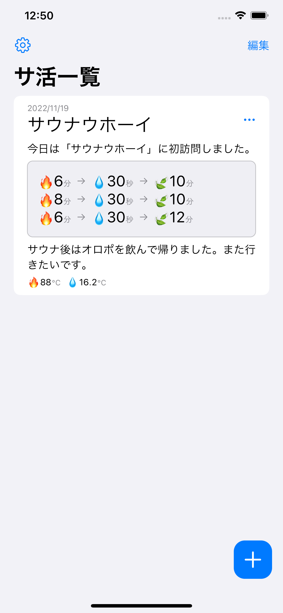
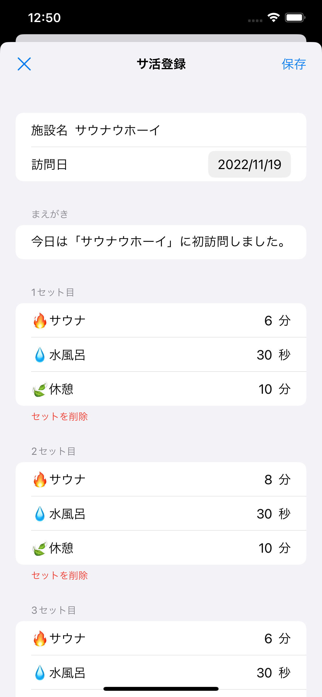
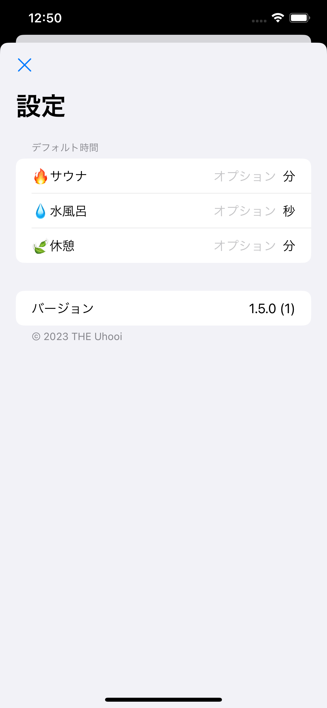
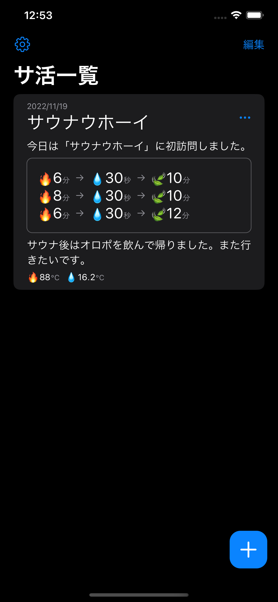
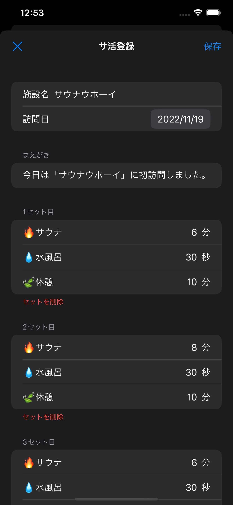
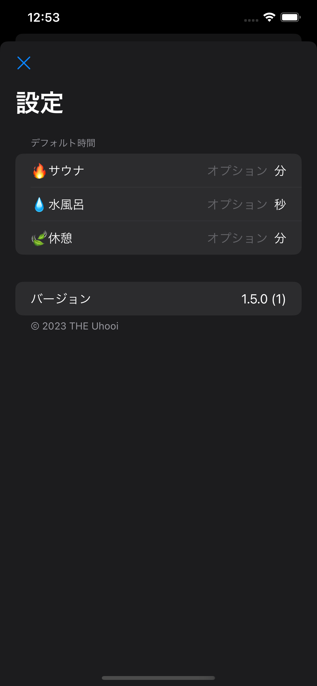
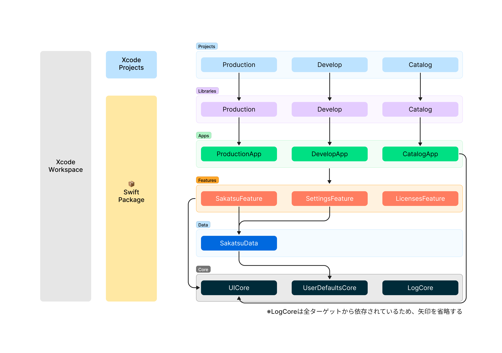

# Loki

[](https://github.com/uhooi/Loki/releases/latest)
[](https://github.com/uhooi/Loki)
[](https://twitter.com/the_uhooi)


Loki（ロキ）は、サ活の記録に特化したアプリです。

<a href="https://apps.apple.com/jp/app/ロキ/id6444580805?itsct=apps_box_badge&amp;itscg=30200" style="display: inline-block; overflow: hidden; border-radius: 13px; width: 250px; height: 83px;"></a>

## 目次

- [スクリーンショット](#スクリーンショット)
- [開発](#開発)
- [貢献](#貢献)

## スクリーンショット

<details><summary>スクリーンショット</summary>

### ライト

|サ活一覧|サ活登録|設定|
|:--:|:--:|:--:|
||||

### ダーク

|サ活一覧|サ活登録|設定|
|:--:|:--:|:--:|
||||

</details>

## 開発

誰でもこのプロジェクトを開発できます。

### 必要条件

- macOS 12.5+
- Xcode 14.2 (Swift 5.7.2)
- Make

### 構成

- UIの実装: SwiftUI
- アーキテクチャ: MVVM
- ブランチモデル: GitHub flow

### セットアップ

1. このプロジェクトをクローンします。  
    ```shell
    $ git clone https://github.com/uhooi/Loki.git
    $ cd Loki
    ```

2. Swiftプロジェクトの高速ビルドを有効にします。（任意）  
    ```shell
    $ defaults write com.apple.dt.XCBuild EnableSwiftBuildSystemIntegration 1
    ```

3. `make setup` を実行します。  
セットアップが完了すると、自動的にXcodeでワークスペースが開きます。

### モジュール分割

<details><summary>モジュール分割</summary>

#### 全体



https://www.figma.com/file/T6xPOXP9b1nzRey05q7ZL9/Loki_module_diagram?node-id=0%3A1&t=ucgi2aKXvCYXOjRD-1

- できる限りSwiftパッケージにソースコードを寄せる
  - https://github.com/uhooi/Loki/blob/6159958e6df6f5645c8593e0d7772bd8e3d00cb7/TotonoiPackage
- プロジェクトには最低限のファイルのみ含める
  - https://github.com/uhooi/Loki/blob/6159958e6df6f5645c8593e0d7772bd8e3d00cb7/App/Totonoi
- `Apps` ・ `Features` ・ `Data` ・ `Core` の4層に分ける
  - 参考: https://developer.android.com/topic/modularization

#### Apps

- アプリのエントリポイントで、ルートナビゲーションロジックを格納する
- 基本的にすべてのFeatureモジュールに依存する
- Dataモジュールに依存してはいけない
- Coreモジュールに依存していい

参考: https://developer.android.com/topic/modularization/patterns#app-modules

#### Features

- 各機能のビューやビューモデルを格納する
- Appモジュールに依存してはいけない
- ほかのFeatureモジュールに依存してはいけない
- DataやCoreモジュールに依存していい

参考: https://developer.android.com/topic/modularization/patterns#feature-modules

#### Data

- リポジトリやモデルを格納する
- AppやFeatureモジュールに依存してはいけない
- できる限りほかのDataモジュールに依存しない
- Coreモジュールに依存していい

参考: https://developer.android.com/topic/modularization/patterns#data-modules

#### Core

- 複数のモジュールが共通で使う処理を格納する
- AppやFeature、Dataモジュールに依存してはいけない
- ほかのCoreモジュールに依存していい

参考: https://developer.android.com/topic/modularization/patterns#common-modules

</details>

### コーディングルール

<details><summary>コーディングルール</summary>

#### 全体

- できる限りAPI Design Guidelinesに従う
  - https://www.swift.org/documentation/api-design-guidelines/
- できる限り `any` より `some` を使う
- 存在型には必ず `any` を付ける

#### ビュー

##### 共通

- ビューは単体テストを書かない
  - UIは手動でテストすることが多く、費用対効果に合わないため
- できる限り分岐（ `if` ・ `switch` ）を入れない
  - 単体テストを書かないため
- できる限り `Task { ... }` をビューに書く
  - ビューモデルの単体テストが書きづらくなるため
    - 参考: https://speakerdeck.com/koher/swift-concurrencyshi-dai-noiosapurinozuo-rifang?slide=106
- 状態はビューモデルの `uiState` に集約し、ビューでは保持しない
  - つまり `@State` を使わず、 `@StateObject` はビューモデルのみに付ける
  - `@Published` もビューモデルの `uiState` のみに付ける
- できる限り `@AppStorage` を使わず、UserDefaultsへは `Data` 層でアクセスする
  - ビュー層のプロパティを永続化したい場合のみ使う
  - `View` 以外では使わない
  - 参考: https://twitter.com/noppefoxwolf/status/1612800897654075392

##### 親ビュー

- 画面全体のビュー（ここでは「親ビュー」と呼ぶ）を `{画面名}Screen` と命名する
  - 例: [SakatsuListScreen](https://github.com/uhooi/Loki/blob/8d22650afeb777bd15e858bfad2b6ece06dcb152/TotonoiPackage/Sources/Features/Sakatsu/SakatsuList/SakatsuListScreen.swift)
- 以下の処理を親ビューに書く
  - ビューモデルの保持
    - `@StateObject private var` で保持する
    - 例: https://github.com/uhooi/Loki/blob/8d22650afeb777bd15e858bfad2b6ece06dcb152/TotonoiPackage/Sources/Features/Sakatsu/SakatsuList/SakatsuListScreen.swift#L5
  - ナビゲーションロジック
    - `NavigationStack { ... }` や `NavigationSplitView { ... }` 、 `.navigationTitle()` 、 `.navigationBarTitleDisplayMode()` など
    - 例: https://github.com/uhooi/Loki/blob/8d22650afeb777bd15e858bfad2b6ece06dcb152/TotonoiPackage/Sources/Features/Sakatsu/SakatsuList/SakatsuListScreen.swift#L8  
    https://github.com/uhooi/Loki/blob/8d22650afeb777bd15e858bfad2b6ece06dcb152/TotonoiPackage/Sources/Features/Sakatsu/SakatsuList/SakatsuListScreen.swift#L19  
   https://github.com/uhooi/Loki/blob/8d22650afeb777bd15e858bfad2b6ece06dcb152/TotonoiPackage/Sources/Features/Sakatsu/SakatsuInput/SakatsuInputScreen.swift#L45
  - ツールバー、シートやアラートなど、画面全体に関わる表示
    - `.toolbar { ... }` 、 `.sheet()` や `.alert()` など
    - 例: https://github.com/uhooi/Loki/blob/8d22650afeb777bd15e858bfad2b6ece06dcb152/TotonoiPackage/Sources/Features/Sakatsu/SakatsuList/SakatsuListScreen.swift#L20-L36  
    https://github.com/uhooi/Loki/blob/8d22650afeb777bd15e858bfad2b6ece06dcb152/TotonoiPackage/Sources/Features/Sakatsu/SakatsuList/SakatsuListScreen.swift#L45-L103
- 親ビューは最低限の処理のみ書き、ほかは直下の子ビューに書く
  - `{画面名}View` と命名する
  - 例: https://github.com/uhooi/Loki/blob/8d22650afeb777bd15e858bfad2b6ece06dcb152/TotonoiPackage/Sources/Features/Sakatsu/SakatsuList/SakatsuListScreen.swift#L9-L18

##### 子ビュー

- ビューモデルを直接参照せず、状態ホイスティングを適用する
  - 参考: https://developer.android.com/jetpack/compose/state#state-hoisting
  - つまり表示する現在の値と、値を変更するイベントのハンドラを親ビューから渡す
  - `@Binding` や `${変数名}` は使わない
    - 例: https://github.com/uhooi/Loki/blob/8d22650afeb777bd15e858bfad2b6ece06dcb152/TotonoiPackage/Sources/Features/Sakatsu/SakatsuList/SakatsuListView.swift#L4-L9

#### ビューモデル

- 1画面1ビューモデルとする
- `{画面名}ViewModel` と命名する
  - 例: [SakatsuListViewModel](https://github.com/uhooi/Loki/blob/8d22650afeb777bd15e858bfad2b6ece06dcb152/TotonoiPackage/Sources/Features/Sakatsu/SakatsuList/SakatsuListViewModel.swift)
- `UIKit` や `SwiftUI` などのUIフレームワークをインポートしない
  - ビューモデルにUIを持ち込みたくないため
- `@MainActor` を付けた `final class` とし、 `ObservableObject` に準拠する
  - 例: https://github.com/uhooi/Loki/blob/8d22650afeb777bd15e858bfad2b6ece06dcb152/TotonoiPackage/Sources/Features/Sakatsu/SakatsuList/SakatsuListViewModel.swift#L33-L34
- 状態を `uiState` で一元管理し、 `private(set)` にしてビューから状態を変更させない
  - 構造体名は `{画面名}UiState` とする
  - 例: https://github.com/uhooi/Loki/blob/8d22650afeb777bd15e858bfad2b6ece06dcb152/TotonoiPackage/Sources/Features/Sakatsu/SakatsuList/SakatsuListViewModel.swift#L5-L13  
     https://github.com/uhooi/Loki/blob/8d22650afeb777bd15e858bfad2b6ece06dcb152/TotonoiPackage/Sources/Features/Sakatsu/SakatsuList/SakatsuListViewModel.swift#L35
- エラーは画面ごとに1つの列挙型へまとめ、 `uiState` で1つのみ保持する
  - エラーはアラートで表示することが多く、1つの型になっていると複数同時に表示されないことが保証されるため
  - エラー名は `{画面名}Error` とする
  - 例: https://github.com/uhooi/Loki/blob/8d22650afeb777bd15e858bfad2b6ece06dcb152/TotonoiPackage/Sources/Features/Sakatsu/SakatsuList/SakatsuListViewModel.swift#L15-L29  
  https://github.com/uhooi/Loki/blob/8d22650afeb777bd15e858bfad2b6ece06dcb152/TotonoiPackage/Sources/Features/Sakatsu/SakatsuList/SakatsuListViewModel.swift#L12
- ビューのイベントをハンドリングする
  - 基本的にはメソッド名をそのまま採用する
  - 例: https://github.com/uhooi/Loki/blob/8d22650afeb777bd15e858bfad2b6ece06dcb152/TotonoiPackage/Sources/Features/Sakatsu/SakatsuList/SakatsuListViewModel.swift#L54-L139

</details>

### パッケージ管理

<details><summary>パッケージ管理</summary>

#### ライブラリ

##### Swift製

- `Package.swift` のみで管理する
  - 例: https://github.com/uhooi/Loki/blob/6159958e6df6f5645c8593e0d7772bd8e3d00cb7/TotonoiPackage/Package.swift#L19-L21

##### その他

- できる限り使わない
- どうしても使う場合、適切に管理する

#### CLIツール

##### Swift製

- Build Tool PluginまたはCommand Pluginで管理する
  - 用意されていない場合は自作してOSSにPRを送る
  - マージされない場合、本リポジトリまたはプラグイン用のリポジトリを作成してコミットする
- どうしてもPluginを用意できない場合、Mintで管理する

##### Ruby製

- できる限り使わない
- どうしても使う場合、Bundlerで管理する

##### その他

- できる限り使わない
- どうしても使う場合、適切に管理する

</details>

## 貢献

貢献をお待ちしています :relaxed:

- [新しいイシュー](https://github.com/uhooi/Loki/issues/new)
- [新しいプルリクエスト](https://github.com/uhooi/Loki/compare)
