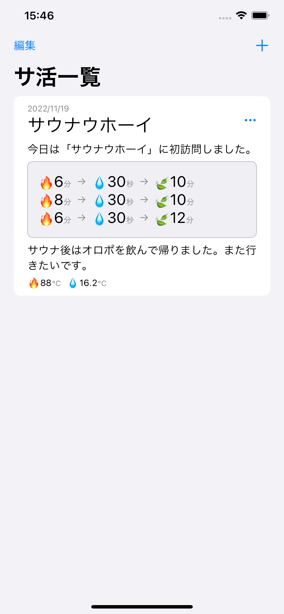
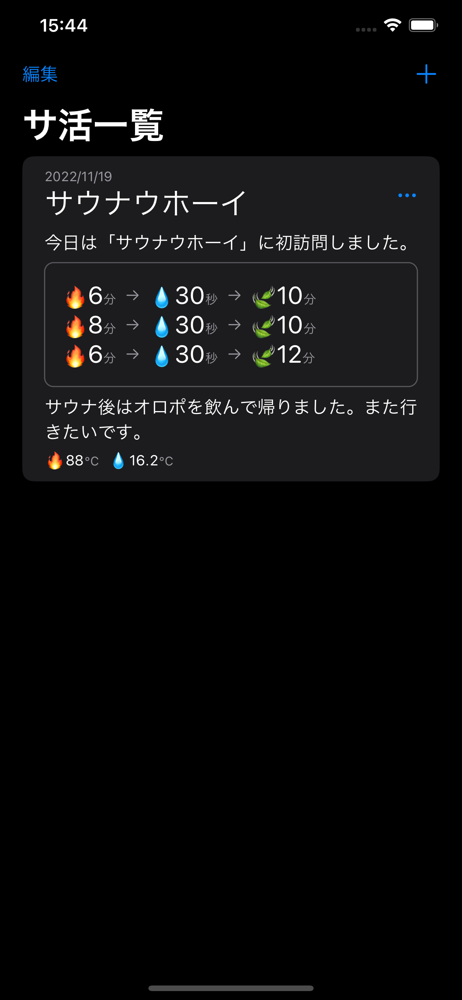

# Loki

[](https://github.com/uhooi/Loki/releases/latest)
[](https://github.com/uhooi/Loki)
[](https://twitter.com/the_uhooi)

Loki（ロキ）は、サ活の記録に特化したアプリです。

<a href="https://apps.apple.com/jp/app/ロキ/id6444580805?itsct=apps_box_badge&amp;itscg=30200" style="display: inline-block; overflow: hidden; border-radius: 13px; width: 250px; height: 83px;"></a>

## 目次

- [スクリーンショット](#スクリーンショット)
- [開発](#開発)
- [貢献](#貢献)

## スクリーンショット

<details><summary>スクリーンショット</summary>

### ライト

|サ活一覧|サ活登録|
|:--:|:--:|
|||

### ダーク

|サ活一覧|サ活登録|
|:--:|:--:|
|||

</details>

## 開発

誰でもこのプロジェクトを開発できます。

### 必要条件

- macOS 12.5+
- Xcode 14.1 (Swift 5.7.1)
- Make

### 構成

- UIの実装: SwiftUI
- アーキテクチャ: MVVM
- ブランチモデル: GitHub flow

### セットアップ

1. このプロジェクトをクローンします。  
    ```shell
    $ git clone https://github.com/uhooi/Loki.git
    $ cd Loki
    ```

2. Swiftプロジェクトの高速ビルドを有効にします。（任意）  
    ```shell
    $ defaults write com.apple.dt.XCBuild EnableSwiftBuildSystemIntegration 1
    ```

3. `make setup` を実行します。  
セットアップが完了すると、自動的にXcodeでワークスペースが開きます。

### アーキテクチャ

<details><summary>アーキテクチャ</summary>

#### 全体

- できる限りSwiftパッケージにソースコードを寄せる
  - https://github.com/uhooi/Loki/tree/main/TotonoiPackage
- プロジェクトには最低限のファイルのみ含める
  - https://github.com/uhooi/Loki/tree/main/App/Totonoi

#### アーキテクチャ

- `Features` ・ `Data` ・ `Core` の3層に分ける
  - 参考: https://developer.android.com/topic/modularization

##### Features

- 各機能のビューとビューモデルを格納する
  - 参考: https://developer.android.com/topic/modularization/patterns#feature-modules

##### Data

- リポジトリやモデルを格納する
  - 参考: https://developer.android.com/topic/modularization/patterns#data-modules

##### Core

- 複数のターゲットが共通で使う処理を格納する
  - 参考: https://developer.android.com/topic/modularization/patterns#common-modules

</details>

### コーディングルール

<details><summary>コーディングルール</summary>

#### 全体

- できる限りAPI Design Guidelinesに従う
  - https://www.swift.org/documentation/api-design-guidelines/
- できる限り `any` より `some` を使う
- 存在型には必ず `any` を付ける

#### ビュー

##### 共通

- ビューは単体テストを書かない
  - UIは手動でテストすることが多く、費用対効果に合わないため
- できる限り分岐（ `if` ・ `switch` ）を入れない
  - 単体テストを書かないため

##### 親ビュー

- 画面全体のビューを `〜Screen` と命名する
  - 例: [SakatsuListScreen](https://github.com/uhooi/Loki/blob/8d22650afeb777bd15e858bfad2b6ece06dcb152/TotonoiPackage/Sources/Features/Sakatsu/SakatsuList/SakatsuListScreen.swift)
- 以下の処理を親ビューに書く
  - ビューモデルの保持
    - `@StateObject private var` で保持する
    - 例: https://github.com/uhooi/Loki/blob/8d22650afeb777bd15e858bfad2b6ece06dcb152/TotonoiPackage/Sources/Features/Sakatsu/SakatsuList/SakatsuListScreen.swift#L5
  - ナビゲーションロジック
    - `NavigationView { ... }` や `.navigationTitle()` など
    - 例: https://github.com/uhooi/Loki/blob/8d22650afeb777bd15e858bfad2b6ece06dcb152/TotonoiPackage/Sources/Features/Sakatsu/SakatsuList/SakatsuListScreen.swift#L8  
    https://github.com/uhooi/Loki/blob/8d22650afeb777bd15e858bfad2b6ece06dcb152/TotonoiPackage/Sources/Features/Sakatsu/SakatsuList/SakatsuListScreen.swift#L19
  - ツールバー、シートやアラートなど、画面全体に関わる表示
    - `.toolbar { ... }` 、 `.sheet()` や `.alert()` など
    - 例: https://github.com/uhooi/Loki/blob/8d22650afeb777bd15e858bfad2b6ece06dcb152/TotonoiPackage/Sources/Features/Sakatsu/SakatsuList/SakatsuListScreen.swift#L20-L36  
    https://github.com/uhooi/Loki/blob/8d22650afeb777bd15e858bfad2b6ece06dcb152/TotonoiPackage/Sources/Features/Sakatsu/SakatsuList/SakatsuListScreen.swift#L45-L103

##### 子ビュー

- ビューモデルを直接参照せず、状態ホイスティングを適用する
  - 参考: https://developer.android.com/jetpack/compose/state#state-hoisting

#### ビューモデル

- `UIKit` や `SwiftUI` などのUIフレームワークをインポートしない
  - ビューモデルにUIを持ち込みたくないため
- `@MainActor` を付けた `final class` とし、 `ObservableObject` に準拠する
  - 例: https://github.com/uhooi/Loki/blob/8d22650afeb777bd15e858bfad2b6ece06dcb152/TotonoiPackage/Sources/Features/Sakatsu/SakatsuList/SakatsuListViewModel.swift#L33-L34
- ビューのイベントをハンドリングする
  - 例: https://github.com/uhooi/Loki/blob/8d22650afeb777bd15e858bfad2b6ece06dcb152/TotonoiPackage/Sources/Features/Sakatsu/SakatsuList/SakatsuListViewModel.swift#L54-L139

</details>

## 貢献

貢献をお待ちしています :relaxed:

- [新しいイシュー](https://github.com/uhooi/Loki/issues/new)
- [新しいプルリクエスト](https://github.com/uhooi/Loki/compare)
